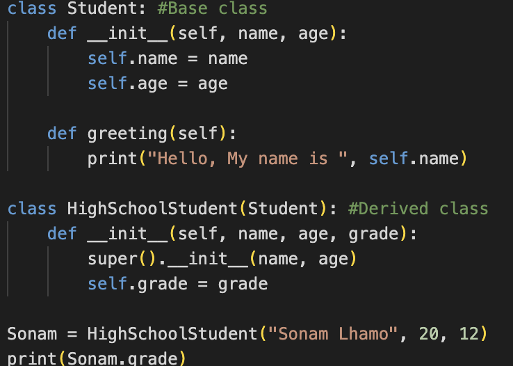

# Unit V: Principles of Object-Oriented Programming

## Introduction to Object Oriented Programming Principle, Benefits, and Applications of OOP

Object-Oriented Programming (OOP) is a programming paradigm that is based on the concepts of **Objects** and **Classes**. OOP concepts in Python make the code more reusable and easier to work with in larger programs.

### Some Applications of OOP:
- Software Development
- Game Development
- Web Development
- Data Analysis and Machine Learning

An **object** is a self-contained entity that encapsulates data (*data members/attributes/property*) and related operations (*methods/behaviors*) that act on that data.

Think of an object as a real-world entity, like a car or a book. A car object would have attributes like `color` and `model`, and methods like `accelerate`, `brake`, and `turn`.

A **class** is a *blueprint* or template for creating objects. It defines the attributes and methods that all objects of that class will share. You can think of a class as a factory that produces objects. The class defines the specifications, and each object created from the class is an instance with its own set of data.

A class is a blueprint for creating objects. An **object** is an *instance* of a *class*.
Let's create a simple Student class having attributes/properties name and age. 

 

The __init__() method is called automatically when a new object is created. It is called a constructor. Constructors and destructors are special methods used for initializing and cleaning up objects, respectively.

Types of constructors : 
**Default constructor:** The default constructor is a simple constructor which doesn’t accept any arguments. Its definition has only one argument which is a reference to the instance being constructed known as ‘self’.

**Parameterized constructor:** constructor with parameters is known as parameterized constructor. The parameterized constructor takes its first argument as a reference to the instance being constructed known as ‘self’ and the rest of the arguments are provided by the programmer.
self is a convention used to represent the instance of the class itself. When you define a method within a class, and you want to access or modify the attributes of that instance, you use self as the first parameter to refer to that instance.

**Destructors** are called when an object gets destroyed. In Python, destructors are not needed as much as in C++ because Python has a garbage collector that handles memory management automatically. 
The __del__() method is known as a destructor method in Python. It is called when all references to the object have been deleted i.e when an object is garbage collected. 

Create Student objects by calling the Student() class:

 

### Class Method
Classes can also contain methods/behaviors which are functions defined inside the class. 
Let's add a method to our Student class:

**NOTE:** The greeting() method can access the object's attributes using self. This allows encapsulation of data and functions.

### Principles of OOP
Encapsulation - Binding data and functions into a single unit called class.

Abstraction - Hiding internal details and showing only essential features.

Inheritance - Ability to create new classes from existing classes.

Polymorphism - Ability to use common operations in different forms for different data inputs.

1. Inheritance
Inheritance is a way of creating a new class for using details of an existing class without modifying it. The newly formed class is a derived class (or child class). Similarly, the existing class is a base class (or parent class).
Let's create a HighSchoolStudent class that inherits from Student:

    

    We can also override methods in the derived class:

    

2. Polymorphism
The word "polymorphism" means "many forms", and in programming it refers to methods/functions/operators with the same name that can be executed on many objects or classes. Polymorphism allows common operations to take on different forms for different data inputs. For example, we can have a common study() method that prints different outputs for different student objects:

    

    The study() method exhibits polymorphic behavior based on the object calling it. This allows common methods to work in different ways for derived classes.

3. Encapsulation
Consider a real-life example of encapsulation, in a company, there are different sections like the accounts section, finance section, sales section etc. The finance section handles all the financial transactions and keeps records of all the data related to finance. Similarly, the sales section handles all the sales-related activities and keeps records of all the sales. Now there may arise a situation when due to some reason an official from the finance section needs all the data about sales in a particular month. In this case, he is not allowed to directly access the data of the sales section. He will first have to contact some other officer in the sales section and then request him to give the particular data. This is what encapsulation is. Here the data of the sales section and the employees that can manipulate them are wrapped under a single name “sales section”. Using encapsulation also hides the data. In this example, the data of the sections like sales, finance, or accounts are hidden from any other section.
Encapsulation refers to the bundling of attributes and methods inside a single class. A private attribute is an attribute of a class that is intended to be restricted in access, meaning it cannot be accessed or modified directly from outside the class. In Python, we denote private attributes using double underscore prefixes. 
    
    For example:

    

    To access or modify private attributes, we use setter and getter methods:

    

    This encapsulates the data and provides controlled access to class attributes.

4. Abstraction
A simple example of this can be a car. A car has an accelerator, clutch, and break and we all know that pressing an accelerator will increase the speed of the car and applying the brake can stop the car but we don’t know the internal mechanism of the car and how these functionalities can work this detail hiding is known as data abstraction.
Abstraction focuses on necessary attributes and behaviors hiding unnecessary details. It allows us to focus on what an object does rather than how it does it. We can achieve abstraction in Python using abstract base classes and interfaces.
While it's true that you can achieve abstraction without using abstract methods and classes, leveraging them provides a more structured and explicit approach, which can lead to better code organization, readability, and maintainability in larger projects or when working collaboratively with others.
Abstract Method: In Python, abstract method feature is not a default feature. To create abstract method and abstract classes we have to import the “ABC” and “abstractmethod” classes from abc (Abstract Base Class) library.
Concrete Method: Concrete methods are the methods defined in an abstract base class with their complete implementation. 

    For Example:

     

