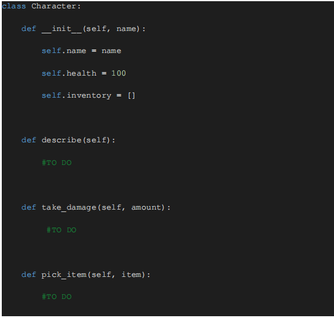
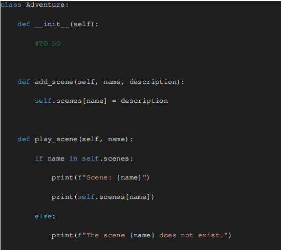
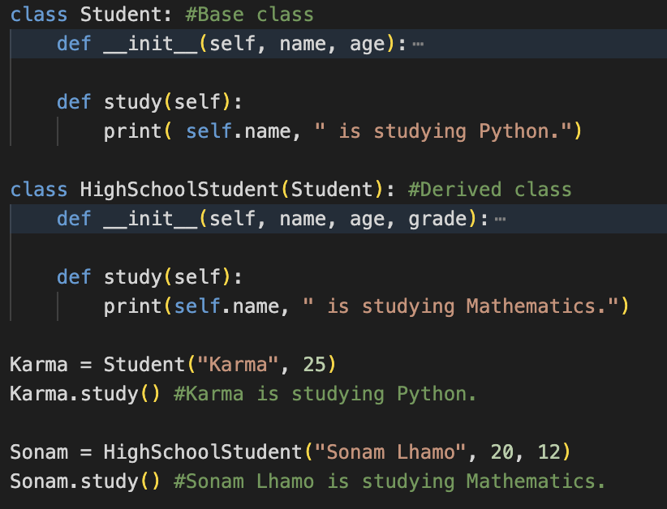

# Worksheet on Adventure Game

### Objective:

By the end of this task, students will:
- Understand the basics of Classes, Objects, and key OOP principles in Python.
- Create and interact with their own classes and objects.
- Complete the given code snippet wherever mentioned “TO DO” and necessary. 
- Submit their work via a GitHub repository and share the link in the WhatsApp group.

### Introduction to OOP Principles

Brief introduction of some important Object-Oriented Programming (OOP) principles:
Encapsulation:

- Explanation: Encapsulation is the bundling of data (attributes) and methods (functions) that operate on the data into a single unit, called a class. It also involves restricting access to certain components, meaning that the internal representation of an object is hidden from the outside.
Example in Practice: In your Character class, the health attribute is an example of encapsulation. You manage it through the take_damage method, ensuring that the health is only modified through this controlled interface.

- Inheritance:
Explanation: Inheritance allows a class to inherit attributes and methods from another class. This promotes code reuse and establishes a relationship between classes.
Example in Practice: You could create a Hero class that inherits from the Character class, adding special abilities unique to heroes.

- Polymorphism:
Explanation: Polymorphism allows methods to do different things based on the object it is acting upon, even if they share the same name. It lets you define methods in a base class and override them in derived classes.
Example in Practice: If you have a Villain class that also inherits from Character, you might override the describe method to add a menacing description unique to villains.

- Abstraction:
Explanation: Abstraction means hiding complex implementation details and showing only the necessary features of an object. It allows you to manage complexity by working with higher-level concepts and ignoring lower-level details.
Example in Practice: In the adventure game, you interact with scenes and characters without needing to know the details of how these are implemented internally.

### Task Overview: "Build Your Own Adventure Game"
**Part 1: Create the Characters**

1. Task: Design a Python class called Character.
    - Attributes:
        - name (string): The name of the character.
        - health (integer): The health points of the character, starting at 100.
        - inventory (list): An empty list to hold items the character collects.
    - Methods:
        - describe(): Print a description of the character, including their name, health, and inventory.
        - take_damage(amount): Reduce the character's health by the given amount.
        - pick_item(item): Add an item to the character's inventory.
    
        Complete the following code snippet:

         

**Part 2: Create the Adventure**

1. Task: Design a Python class called Adventure.
    - Attributes:
        - characters (list): A list of Character objects involved in the adventure.
        - scenes (dictionary): A dictionary where keys are scene names and values are descriptions of those scenes.
    - Methods:
       -  add_scene(name, description): Add a scene to the adventure.
       -  play_scene(name): Print the description of the scene and let the character take an action (e.g., find an item, take damage).

        Complete the following code snippet:

         

**Part 3: Inheritance and Polymorphism**

1. Task: Extend the Character class by creating subclasses Hero and Villain.
    - Hero Class: Inherits from Character.
        - Add an ability called heal(amount) that increases health.
    - Villain Class: Inherits from Character.
        - Override the describe() method to add an evil twist to the description.

     

**Part 4: Combine It All** 

1. Task: Bring everything together by creating a short text-based adventure game.
    1) Create a Hero Object: Use the Hero class to create a character named "Archer".
    2) Create a Villain Object: Use the Villain class to create a character named "Goblin".
    3) Create an Adventure Object: Use the Adventure class to initialize an adventure.
    4) Add Scenes to the Adventure:

        Use the add_scene(name, description) method to create and add scenes to your adventure.

        Each scene is represented as a key-value pair, where the key is the scene name and the value is the scene description.

        Scene 1: (scene name : “Forest”; Scene description: "You are in a dark forest. There's a shiny object on the ground.". )

        Scene 2:  (scene name : “Cave”; Scene description: "The cave is dark and you can hear growling.". )

    5) Play the "Forest" Scene: Have your Hero and Villain objects interact with the scenes in the adventure.
        
        Use the play_scene("Forest") method to start the "Forest" scene.
        
        Have the hero object interact with this scene.

         

    6) Hero Picks Up an Item:
    
        Use the pick_item(item) method of the Hero class to add a "Shiny Sword" to the hero's inventory.

    7) Describe the Hero:
    
        Use the describe() method to display the hero's current state, including their name, health, and inventory.

    8) Play the "Cave" Scene:
        
        Use the play_scene("Cave") method to start the "Cave" scene.

    9) Hero Takes Damage: 
        
        Use the take_damage(amount) method of the Hero class to reduce the hero's health by 20 points.

    10) Describe the Hero Again

### Submission Instructions:

1. Complete the Task: 
    - Implement the code in Python.
    - Add comments to explain your code and the OOP principles you applied.
    - Make sure the code runs without errors.
2. Push your code to the repository.
3. Submit Your Work:
    - Share the link to your GitHub repository in the google classroom for module tutor to review your code. 

