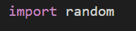
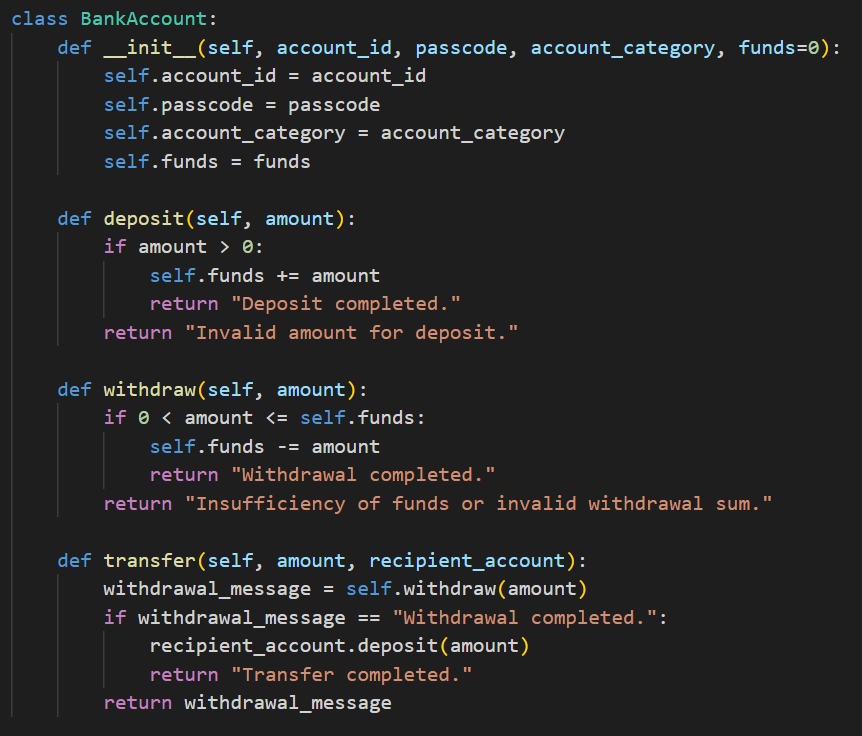
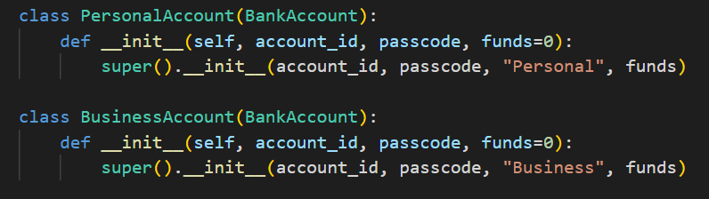
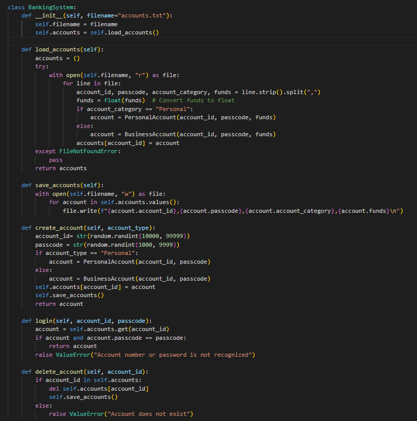
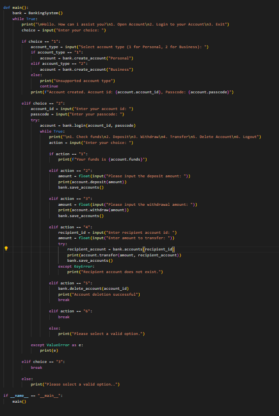

# Worksheet on Online Banking Application

Problem Statement:

You will create a terminal based functioning banking application using python language where:
- You can open a Bank Account and the application will give you account number and a default password. Save the information like account number, password, bank type and then balance amount in a txt file called “accounts.txt”.

- Implement login functionality for created accounts by reading the information from the file and checking balance. 

- Make the Account Class have properties like accountNumber, balance, accountType, savings, current, etc. 

- Implement functionality for depositing, withdrawing, and deleting personal accounts after logging in. 

- Implement sending money to other accounts and implement error handling like insufficient funds or if the receiving account exists or not. 

- Implement functionality for Types of Bank Account like BusinessAccounts & PersonalAccounts. 
    
**NOTE**: Use OOP principles like Classes, Objects, Inheritance, Abstraction, etc. 

## Overview of the Program Structure
**Classes:**

- BankAccount: The base class for creating bank accounts.

- PersonalAccount and BusinessAccount: Subclasses that define different types of accounts.

- BankingSystem: Manages account creation, login, transactions, and data persistence.

- Main Function: The entry point for the application, which provides a menu-driven interface for users to interact with the banking system.

### Follow the given following steps carefully:

1. Create a new python file. 
2. Import the necessary packages that need to be used like the one given below, i.e random package:

    

3. Create a BankAccount Class: 
The class should consist of following things:
-Constructor (__init__): Initializes the account with an ID, passcode, category, and initial funds.
Methods:
    - deposit(amount): Adds funds to the account.
    - withdraw(amount): Removes funds from the account if sufficient funds are available.
    - transfer(amount, recipient_account): Transfers funds to another account by withdrawing from the current account and depositing it to the recipient.
    
     

4. Then create a PersonalAccount and BusinessAccount Classes
These classes inherit from BankAccount. They are used to create specific types of accounts (personal or business) and initialize them with the appropriate account category.

      

5. Then create a BankingSystem Class: 

    The BankingSystem class manages the overall banking operations, including account management, saving and loading account data, and handling user interactions.
    Key Methods in BankingSystem:

    - __init__: Initializes the system and loads existing accounts from a file.
    - load_accounts(): Reads account data from a text file and creates account instances.
    - save_accounts(): Writes the current accounts and their details back to the file.

        ***Refer [here](https://www.dataquest.io/blog/read-file-python/#:~:text=Python%20provides%20a%20built-in,we%20can%20manipulate%20its%20content) to learn how to read/write on the file***. 

    - create_account(account_type): Creates a new account (personal or business) with a unique ID and passcode.
    - login(account_id, passcode): Validates login credentials and returns the corresponding account.
    - delete_account(account_id): Deletes an account from the system and updates the file.

    

6. Now, create a Main Function: 

    The main() function provides a command-line interface for users to interact with the banking system. It displays a menu for creating accounts, logging in, and performing various banking operations.

    The program starts by calling the main() function.
    Menu Options:
    - Open Account: Users can choose to create either a personal or business account.
    - Login to your Account: Users can log into their existing accounts using their account ID and passcode.
    - Exit: Terminates the program.

    Inside the Loop:

    After logging in, users can check their balance, deposit funds, withdraw funds, transfer funds to another account, delete their account, or log out.

    

7. Lastly, save the python code and start executing it. 

### Submission Instructions:

1. Comment the code based on your understanding wherever necessary. 
2. Push your code to the repository.
3. Submit Your Work:
    - Share the link to your GitHub repository in the google classroom for module tutor to review your code. 