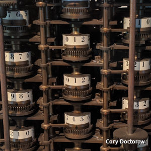

# Introduction To Computing 

The word **computer** derives from the word **compute** which means to calculate. The history of computers which are devices used to calculate and do simple arithmetic operation dates all the way back to ancient China where **abacus** was used to perform basic mathematical operations fast and efficicently. They were also often used to store the results of such operations.

	

## History
While the evolutionary journey of computing is fascinating, its concerns lie beyond the scope of the syllabus, but feel free to read more about it [here](https://www.cs.uah.edu/~rcoleman/Common/History/History.html). What cocnerns us most now is the invention of Mark I in 1944 by Dr. Howard Aiken and Grace Hopper. This is said to be a crucial landmark for the world of computing as Mark I was considered to be worlds first electormechanical computer capable of making logical decisions. 

## Today
Our second point of concern is invention of transistors in 1948 at Bell Labs which forever changed the course of computers and modern day electronics. Ever since these signifcant milestones, computers have become smaller and faster as described by the [Moores Law](https://www.wallstreetmojo.com/moores-law/).Today, we use hand held devices with the computing power which is atleast 100,000 times more than what was used to send the (Apollo 11 mission to the moon)[https://sellmycisco.co.uk/smartphone-vs-apollo-program-a-fascinating-comparison/]. 

## Tomorrow 
But what is in store for us tomorrow? With the growth of AI industry and improvements in GPU compute, we are pushing the limits of compute as well as data to an unimaginable scale. With the potential of [quantum computers](https://aws.amazon.com/what-is/quantum-computing/) still in the horizon the future of computers sure is promising. I hope that throughout the course of this module, we are able to give a good feel of what computers are, what they are capable of and how you can use them to your advantage for years to come.   

<em>Note: Dont be concerned if the terms and concepts discussed in these articles seem concerning, we will discuss the key concepts in class.</em>