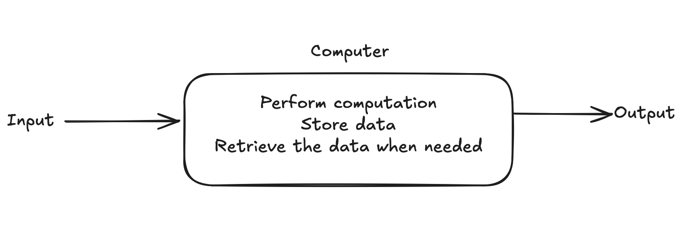
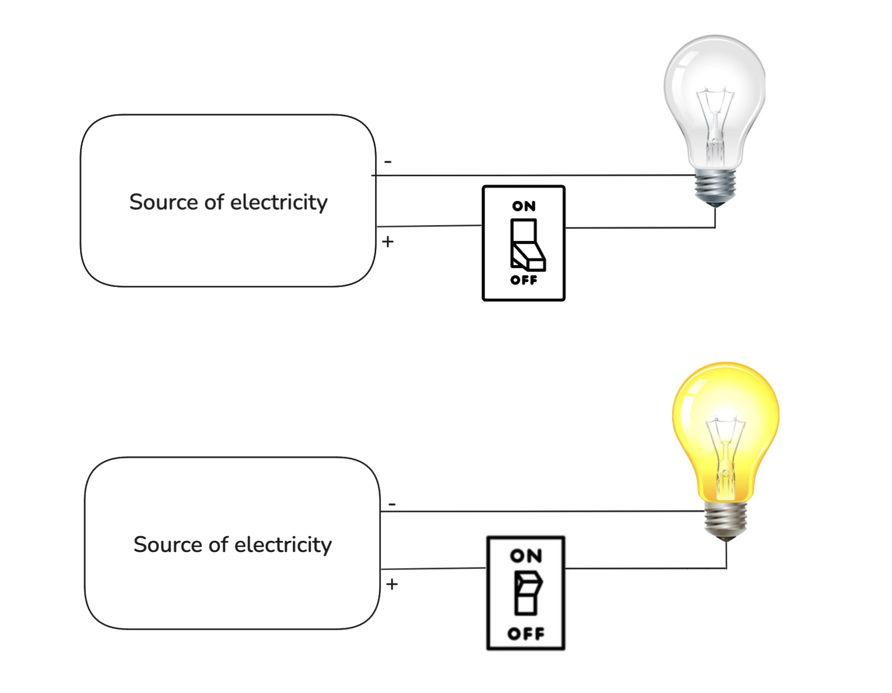
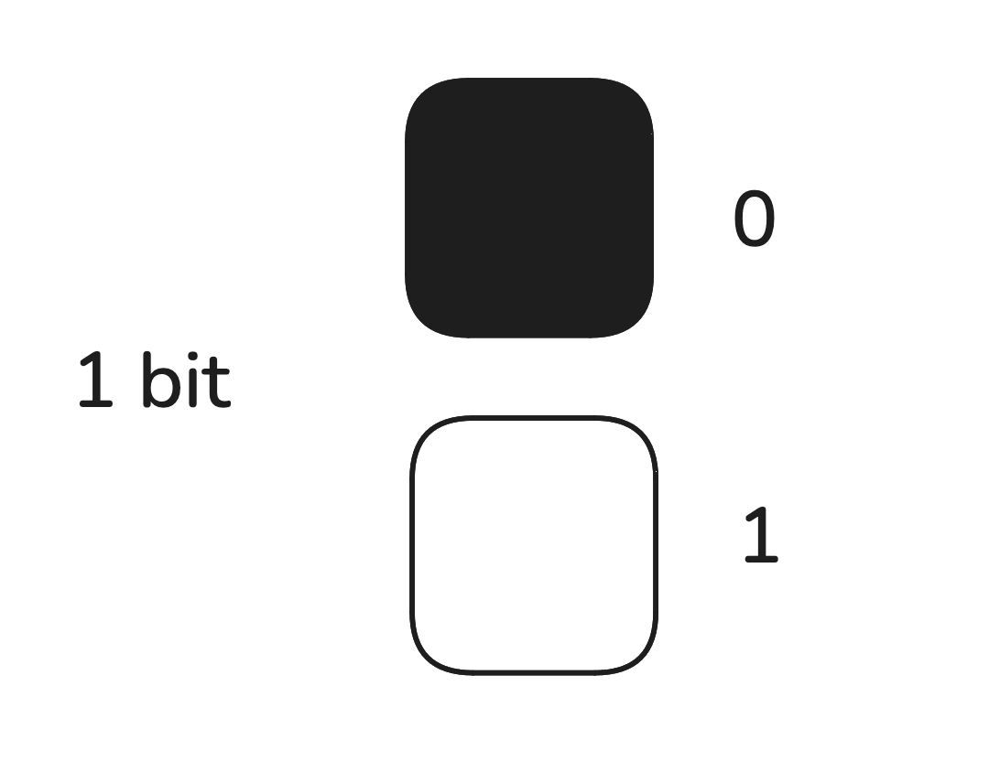
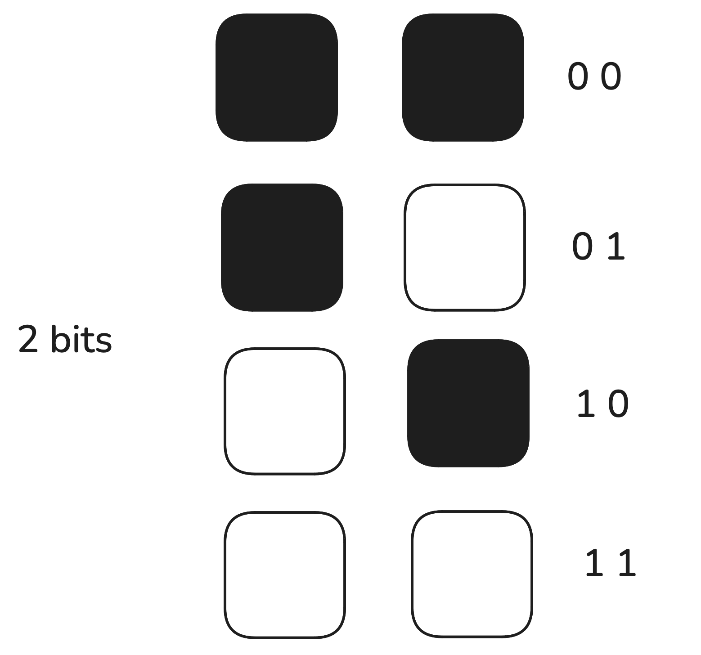

# Information Representation

An over simplified definition of a computer would be a device that can recieve input, process this input to do some computation, store necesarry data, and retrieve this data to present an output when needed. We will discuss more about various parts of a computer and their unqiue functions in the later part of the chapter, but for now we,  will take a bottom-up approach of learning the fundamental components that makes up a computer.

For this topic, we are to understand the following key concepts:
* How does a computer store data?
* Where does a computer store data?
* What format does a computer store data in?
* How does a computer perform basic airthmetic operations with this stored information?
  

## 1.2.1 Bits and Binary numbers. 
Computers are made up of millions of small electronic devices. These devices are responsible for representing information, performing calculations and storing information and while these functions seem distinctly different from each other, the parts that perform these functions are all made up of the same fundamental electronic components in different configurations. 

### Bits
Imagine a light bulb that is connected to a single switch. When the switch is turned on the bulb lights up and when it is turned off the bulb turns off. A lightbulb in this case can represent two states of either being on or off. We can then go ahead and label the off state of a light bulb to be 0 and the on state to be 1. A bulb can only have two possible states in this analogy and we can proceed to describe the nature of states of a light bulb to be binary.

Similar to this imaginary light bulb, computer are made up of millions of parts that function similar to the aforementioned switches, where a <em>bit</em> may represent 0 or 1. Note that one bit can represent only two states, however if two bits are placed side by the side, they can represent 4 states in combination as shown in the graphic below. 

 <em>Fig: one bit represents two states </em> 

 <em>Fig: two bits represents four states </em>

Similarly many bits can be used to represent many states, note that if the number of bits used is equal to n, the total number of states a combination of n bits can represent can be calculcated as 2n(where n>=1 and cannot be 0, negative or a fraction).

### Binary Number System
This positional number system which represents numbers using 0's and 1's is known as the binary number system.The following table highlights number of bits and its relation to number of states the bits can represent:

|No of bits| No of States|
-----------|--------------
|1|2|
|2|4|
|3|8|
|4|16|
|5|32|
|6|64|
|7|128|
|8|256|

### Storage 

In practise, when storing information the term byte is often used which represents a total of 256 states (23) which can be represented by a combination of 8 bits. Meaning 1 byte consists of 256 possible states and one byte of information represets one such state, Similarly other units of measurements are as stated in the table below:

|Units of measurement| Experession in powers of 2|
-----------|--------------
|Byte|23|
|Kibibyte(KiB)|210|
|Mebibyte(MiB)|220|
|Gigibyte(GiB)|230|
|Tebibyte(TiB)|240|
|Pebibyte(PiB)|250|

There is a variation in how size of data is representation in terms of binary and decimal number systems. For marketing and generic purposes, the terms such as Kilobytes, Megabytes and Gigabytes are used more often. You can read more about his in the official [IBM article here](https://www.ibm.com/docs/en/storage-insights?topic=overview-units-measurement-storage-data).

## 1.2.2 Binary, Octal, and Hexadecimal, Number systems 

A number can be represented with different base values. We are familiar with the numbers in the base 10 (known as decimal numbers), with digits taking values 0,1,2,…,8,9

A computer uses a Binary number system which has a base 2 and digits can have only TWO values: 0 and 1.

A decimal number with a few digits can be expressed in binary form using a large number of digits. Thus the number 65 can be expressed in binary form as 1000001.

The binary form can be expressed more compactly by grouping 3 binary digits together to form an octal number. An octal number with base 8 makes use of the EIGHT digits 0,1,2,3,4,5,6 and 7

A more compact representation is used by Hexadecimal representation which groups 4 binary digits together. It can make use of 16 digits, but since we have only 10 digits, the remaining 6 digits are made up of first 6 letters of the alphabet. Thus the hexadecimal base uses 0,1,2,….8,9,A,B,C,D,E,F as digits.

The table below shows how different number represents different number:
| Decimal | Binary | Octal | Hexadecimal |
----------|--------|-------|--------------
| 0       | 0000   | 0     | 0           |
| 1       | 0001   | 1     | 1           |
| 2       | 0010   | 2     | 2           |
| 3       | 0011   | 3     | 3           |
| 4       | 0100   | 4     | 4           |
| 5       | 0101   | 5     | 5           |
| 6       | 0110   | 6     | 6           |
| 7       | 0111   | 7     | 7           |
| 8       | 1000   | 10    | 8           |
| 9       | 1001   | 11    | 9           |
| 10      | 1010   | 12    | A           |
| 11      | 1011   | 13    | B           |
| 12      | 1100   | 14    | C           |
| 13      | 1101   | 15    | D           |
| 14      | 1110   | 16    | E           |
| 15      | 1111   | 17    | F           |

## 1.2.2 Twos complement representation
The twos complement method is a common way to represent signed integers in computers. It is also often used to simplify binary operations as its used to represent negative numbers in binary. The steps for twos complement method are as follows:

* Step 1: Start with the absolute binary representation of a number
* Step 2: Ivert all bits (change 0's to 1s and vice vaersa)
* Step 3: Add 1 to this representation

The way twos complement method can be used to represent negative integers as explained in this [handout](https://www.rit.edu/academicsuccesscenter/sites/rit.edu.academicsuccesscenter/files/documents/math-handouts/DM3_TwosComplement_BP_9_22_14.pdf). 

## 1.2.3 Binary operations
Similar to how we perform arithmetic operations such as addition and subtraction in decimal number system, we can do the same for binary numbers. For binary addition, the binary representation of both the numbers are to be placed in a cascade such that both binary representations have equal number of digits. Once this is done the digits can be compared from the position of least significant bit(right most) with the following rules:

* Rule 1: 0 + 0 = 0
* Rule 2: 0 + 0 = 1
* Rule 3: 1 + 0 = 1
* Rule 4: 1 + 1 = 0 (carry)

Similarly for binary subtraction:
* Rule 1: 0 - 0 = 0
* Rule 2: 1 - 0 = 1
* Rule 3: 0 - 1 = 1 (borrow)
* Rule 4: 1 - 1 = 0 

Note that multiplication and division are just repeated addition and subtraction respectively. Examples of binary addition and subtraction operations are available in the following [video](https://www.youtube.com/watch?v=C5EkxfNEMjE).

While the above mentioned rules for binary subtraction is applicable, computers compute differences using the two's complements method. Therefore for binary subtraction using the two's complement method:
* Step 1: take the binary representation of two numbers to be subtracted.
* Step 2: identify the two's complement representation of the subtrahend
* Step 3: add the binary representation of the initial number to the two's complement representation of the subtrahend. 
* Step 4: discard the most signifcant bit of the solution

### Essential resources:
1. Half adders and full adder : [LINK](https://www.youtube.com/watch?v=ecn-8iGDRSo)
2. Binary adder implementation using full adders : [LINK](https://www.youtube.com/watch?v=3jtS-8ZF_CA&lc=Ugh-DDSOaF9szHgCoAEC)
3. Binary subtractor implementation using full adders : [LINK](https://www.youtube.com/watch?v=pD-pjBupkFg&t=20s)

### Additional Resources
1. Binary multiplier circuits : [LINK](https://www.youtube.com/watch?v=U-RnKGMJx_0)
2. How a computer memory works : [LINK](https://youtu.be/p3q5zWCw8J4?si=AVevfn4nH8Hyc3iY)
   

