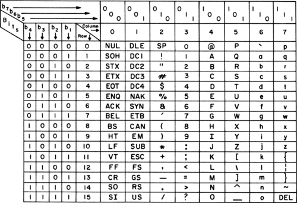

# Character Encoding

## 1.3.1 The ASCII standard
With the understanding of binary and how it can be used to represent many states in combination, it is now important to understand how binary represents different characters in a computer. We can group characters into three main groups i.e. alphabetic characters (a z and A to Z), numeric characters (0-9) and special characters ($,%,#,@ etc). 

ASCII is an international standard which stands for American Standard Code for Information Interchange, which is a character encoding standard for almost all ectronic communication. The chart below provides a visualization of how these characters are represented in binary and what is the equivalent decimal representation for each unique character. 

    
    <em>
ASCII chart (1972)
</em>

The standard ASCII characters which adds up to 126 unique characters can be represented using [7 bits](https://www.intel.com/content/dam/www/program/education/us/en/documents/the-journery-inside/digital/tji-digital-info-handout4.pdf). However an extended version of the ASCII table called the extended ASCII can represent up to 256 characters using 8 bits.

### Excercise: Use the standard ASCII table to write your full name. 

## 1.3.2 Unicode and UTF8 encoding
While the ASCII table was enough to represent basic alphanumeric characters and few special characters, the computers today have to store other characters such as emojis and characters from different languages. This is not simple as there are many languages with different structures, some languages use alphabets, vowels, and consonants while some langauges use strokes and other form of expression to represent different characters. 

Unicode is one such standard that tries to solve the problem of storing and representing different characters in a computer. While each character is mapped to a bit representation, unicode uses codepoints where different characters are mapped to uniique hexadecimal digita. This representation is made as U+XXXX where U+ means unicode and the XXXX represents hexadecimal numbers. 

The UTF-8 encoding scheme was later developed to ensure that no extra bit space is consumed while representing characters. UTF-8 representation of characters for english is very similar to that of the ASCII table where it only uses one byte(8 bits) or two hexadecimals to represent characters. However, however for more than 127 characters, several bytes are used to represent the characters. You can read more about this in the following articles and official documentation:
1. [Unicode](https://aac.unicode.org/)
2. [UTF-8](https://blog.hubspot.com/website/what-is-utf-8)
3. [General overview of character encoding](https://www.joelonsoftware.com/2003/10/08/the-absolute-minimum-every-software-developer-absolutely-positively-must-know-about-unicode-and-character-sets-no-excuses/)

