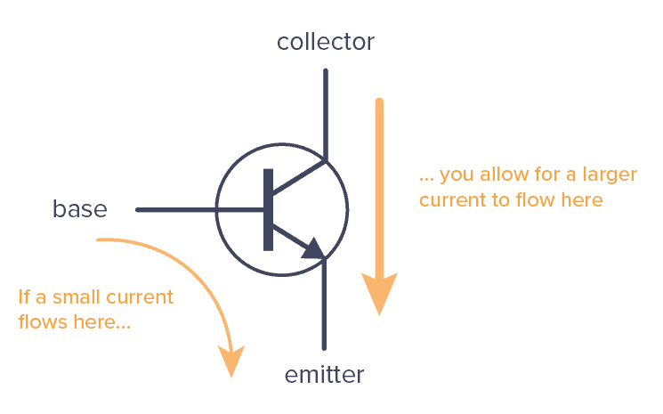
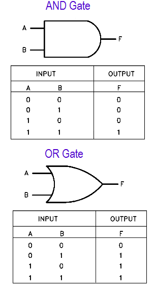
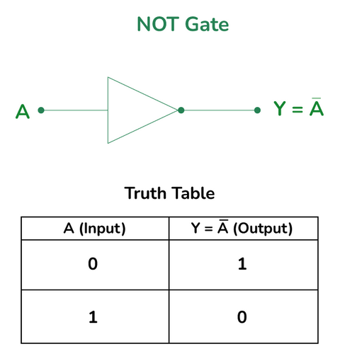
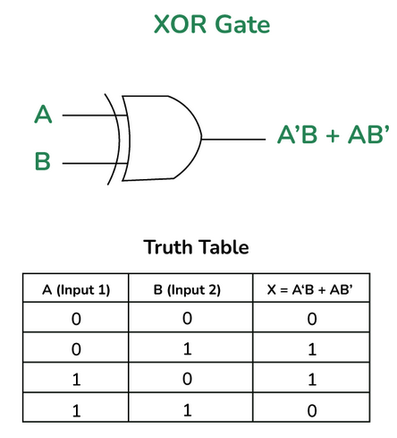
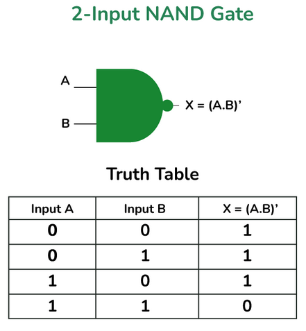

## 1.4 Boolean logic and Logic gates

## 1.4.1 Basic logic gates
The expression of values in binary which uses 0's and 1's can also be used to experess simple logic such as true or false. Computers first used the binary number system as there was an entire branch of mathematics that dealt with representaition and manipulation of true and falase values known as the boolean algebra. The mathematical analysis of logic book written by George Boole in 1847 states that boolean algebra allows for truth to be systematically and formallly proven through logic equations. 

There are three fundamental operations used in boolean algebra known as the AND, OR and the NOT operation. Note that these operations were later simulated into electrical components using transistors and are called logic gates which follow their respective properties as expressed in boolean algebra. A detailed video on this concept can be found [here](https://www.youtube.com/watch?v=gI-qXk7XojA&t=335s).

Transistors are electrically controlled switches whereby, when an adequate amount of electricity flows through one of the input electrode(base), the transistors allows electricity to flow through the other two electrodes(collector to emitter) as shown in the graphic below.

    
    <em>
A simple transistor
</em>

We can represent various logic gates using truth tables. The AND and OR gates can be represented as shown below:

    
    <em>
Truth tables for AND and OR gates
</em>

A NOT gate takes in one input and flips it to its reverse state therefore its truth table is as shown below:

    
    <em>
NOT gate
</em>

## 1.2.2 Composite logic gate

There are other logic gates that prove to be very useful in computers when applying more complex computations. One such example is use of logic gates to perform binary addition and subtraction. The NAND gate in particular is very important as it is also often termed as the universal gate as it can be used to constructure AND, OR and NOT gates when placed in a certain configuration.

Similarly the XOR gate is important as it is used for arithmetic computation. This can be observed in the networking module where XOR logic is used to do error checking and binary addition. There truth tables and symbols are as follows:

    
    

