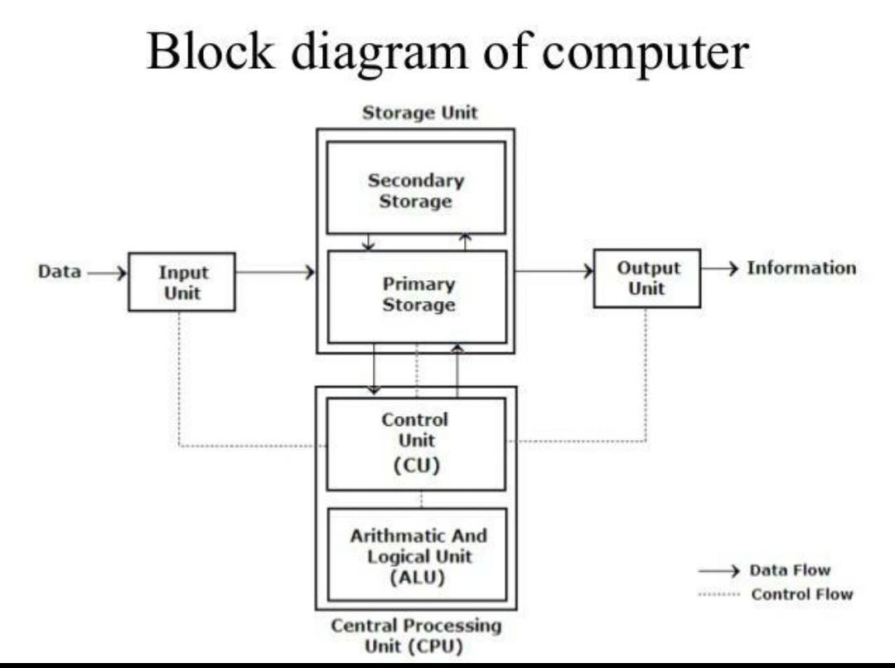

## 1.5 Introduction to computer architecutre
Over the course of many generations in advancement of computers and technology, there has been various improvements with regard to different parts of a computer. A brief history of these generation can be found in this [article](https://vardhaman.org/wp-content/uploads/2021/03/CO.pdf).

The modern day computers have very distinct parts with specialized functions. At a high level, a computer can be escribed using the following diagram:

    
    <em>
Block diagram of a computer
</em>

## Different parts of a computer and its functions

1. Central Processing Unit (CPU)
* Executes instructions and performs calculations
* Key components:
    * Control Unit: Manages and coordinates CPU operations
    * Arithmetic Logic Unit (ALU): Performs arithmetic and logical operations
    * Registers: Small, fast storage locations within the CPU

2. Memory 
* A physical device that stores information temporarily or permanently.
* Provides quick access to data and instructions for the CPU, act as a speed buffer, serve as an active workspace, and hold temporary data
* The two main types include:
  * Random Access Memory (RAM):
    * Volatile memory used for temporary data storage
    * Faster access times compared to storage devices
  * Read-Only Memory (ROM):
    * Non-volatile memory containing essential instructions (e.g., BIOS)

3. Storage devices
* These devices stores data into devices such as drives or disks. 
* Solid state drives (SSD) and Hard disk drives(HDD) are most commonly used.

4. Input/Output devices (I/O)
* Input: Keyboard, mouse, microphone, camera
* Output: Monitor, speakers, printer

5. Bus systems
* Provides connection and enables communication between different parts of a computer
* Data Bus: Transfers data between components
* Address Bus: Carries memory addresses
* Control Bus: Carries control signal

### The Fetch-Decode-Execute Cycle
The fetch-decode-execute cycle (also known as the instruction cycle) is the basic operational process of a computer. It's the sequence of steps that the CPU follows to process each instruction in a program.
1. Fetch
* The CPU retrieves (fetches) an instruction from memory.
* This instruction is stored in a special register called the Instruction Register (IR).
* The Program Counter (PC) keeps track of which instruction to fetch next.

2. Decode
* The CPU interprets (decodes) the instruction.
* It figures out what operation needs to be performed.
* For example, it might be an addition, a memory access, or a jump to another part of the program.

3. Execute
* The CPU carries out (executes) the instruction.
* This might involve:
  * Performing a calculation
  * Moving data
  * Changing the sequence of instructions (in case of a jump)

### 1.5.1 Von Neumann Architecutre

Both Harvard and von Neumann architectures are fundamental designs for computer systems, each with its own approach to handling program instructions and data. Understanding these architectures helps in grasping how different computer systems implement the fetch-decode-execute cycle.

#### Key Characteristics:
* Single memory space for both data and instructions
* Uses a single bus for both data and instruction transfer

#### Fetch-Decode-Execute in von Neumann:
* Fetch: Instructions and data are fetched from the same memory.
* Decode: The CPU decodes the instruction.
* Execute: The CPU executes the instruction, potentially accessing the same memory for data.

#### Advantages:
* Simpler design
* Flexible use of memory (can allocate more space to either instructions or data as needed)

#### Disadvantages:
* Potential bottleneck due to single bus (known as the von Neumann bottleneck)
* Instructions and data compete for memory access

### 1.5.2 Harvard Architecutre

#### Key Characteristics:
* Separate memory spaces for instructions and data
* Uses separate buses for instruction and data transfer

#### Fetch-Decode-Execute in Harvard:
* Fetch: Instructions are fetched from instruction memory.
* Decode: The CPU decodes the instruction.
* Execute: The CPU executes the instruction, accessing data memory if needed.

#### Advantages:
* Can fetch next instruction and access data simultaneously
* Potentially faster execution due to parallel access
* Better security (can make instruction memory read-only)

#### Disadvantages:
* More complex design
* Fixed allocation of memory between instructions and data

#### Comparison in Context
* Memory Access:
  * von Neumann: One memory access per cycle (either instruction or data)
  * Harvard: Can perform instruction fetch and data access in the same cycle
  
* Parallelism:
  * von Neumann: Limited by single bus
  * Harvard: Allows for more parallelism in instruction processing

* Impact on Fetch-Decode-Execute Cycle
  * von Neumann: The cycle may be slowed down when instruction fetch and data access compete for the same memory bus.
  * Harvard: The cycle can potentially be faster as instruction fetch doesn't compete with data access.

#### Modern Implementations:

Many modern CPUs use a modified Harvard architecture, with separate caches for instructions and data, but a unified main memory (like von Neumann)

