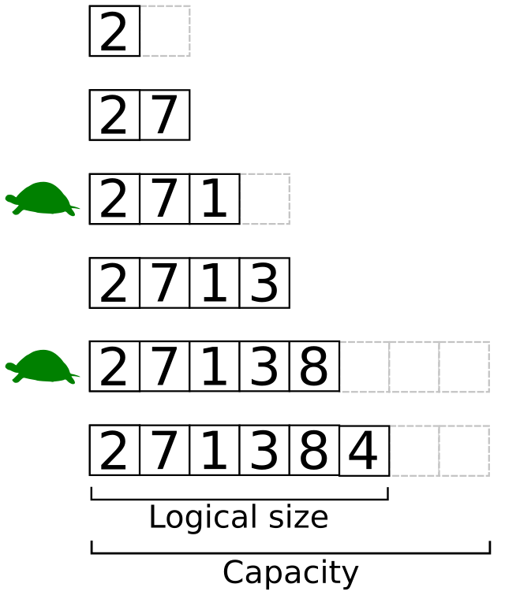

# List (Dynamic Array) Data Structure

## Definition
A List, also known as a Dynamic Array, is a data structure that allows elements to be added or removed, and can grow or shrink in size automatically.



## Key Properties
1. **Dynamic Size**: Can grow or shrink as needed.
2. **Heterogeneous** (in some languages): Can store elements of different data types (e.g., in Python).
3. **Contiguous Memory**: Elements are stored in contiguous memory locations.
4. **Zero-Indexed**: The first element is typically accessed with index 0 (in most programming languages).
5. **Random Access**: Elements can be accessed directly using their index.

## Time Complexity
- Access: O(1)
- Search: O(n) for unsorted, O(log n) for sorted (using binary search)
- Insertion: O(1) amortized for append, O(n) for arbitrary position
- Deletion: O(n)

## Memory Usage
- Initial Memory = (size of data type) * (initial capacity)
- Grows dynamically, often doubling in size when capacity is reached

## Advantages
1. Flexible size (can grow or shrink as needed)
2. Fast access to elements (constant time)
3. Efficient for storing and accessing sequential data
4. Supports various built-in operations and methods

## Disadvantages
1. Slower insertions and deletions compared to linked lists
2. May waste some memory due to over-allocation
3. Resizing operations can be costly

## Common Operations
1. **Append**: Adding an element to the end of the list
2. **Insert**: Adding an element at a specific index
3. **Remove**: Deleting an element by value or index
4. **Pop**: Removing and returning the last element
5. **Index**: Finding the position of a given element
6. **Slice**: Extracting a portion of the list
7. **Sort**: Arranging elements in a specific order

## Implementation Details
1. **Resizing**: When capacity is reached, a new, larger array is allocated (typically 2x size)
2. **Amortized Analysis**: Explains O(1) average time for append operations

## Use Cases
1. Implementing stacks and queues
2. Managing collections of data in memory
3. Representing polynomials or sparse matrices
4. Building more complex data structures

## Memory Techniques for Retention
1. **Visualization**: Imagine a rubber band that can stretch to accommodate more items
2. **Analogy**: Compare a list to an accordion folder that can expand or contract
3. **Acronym**: DCHRO (Dynamic, Contiguous, Heterogeneous, Resizable, Operations-rich)
4. **Chunking**: Group properties into categories (e.g., structural, performance, operations)

## Code Example (Python)

```python
# Creating a list
fruits = ["apple", "banana", "cherry"]

# Appending elements
fruits.append("date")
fruits.extend(["elderberry", "fig"])

# Inserting at a specific index
fruits.insert(1, "blackberry")

# Removing elements
fruits.remove("cherry")
last_fruit = fruits.pop()

# Accessing elements
print(fruits[0])  # Output: apple
print(fruits[-1])  # Output: elderberry

# Slicing
print(fruits[1:4])  # Output: ['blackberry', 'banana', 'date']

# Sorting
fruits.sort()
print(fruits)  # Output: ['apple', 'banana', 'blackberry', 'date', 'elderberry']

# List comprehension
squares = [x**2 for x in range(5)]
print(squares)  # Output: [0, 1, 4, 9, 16]
```
