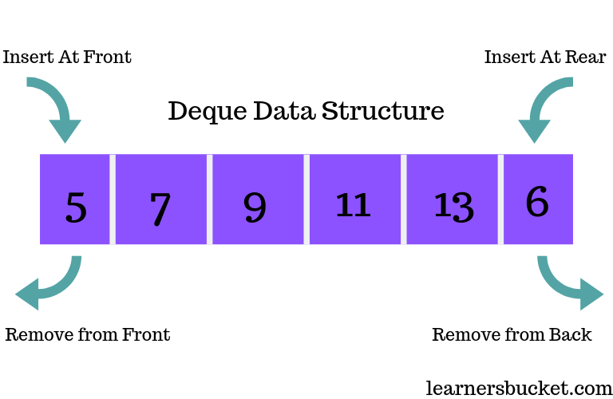

# Deque (Double-ended Queue) Data Structure

## Definition
A Deque (pronounced "deck") is a linear data structure that allows insertion and deletion of elements from both ends. It combines the features of both stacks and queues.



## Key Properties
1. **Double-ended**: Elements can be added or removed from both front and rear.
2. **Flexible**: Supports both LIFO (Last-In-First-Out) and FIFO (First-In-First-Out) operations.
3. **Abstract Data Type (ADT)**: Can be implemented using dynamic arrays or doubly linked lists.
4. **Dynamic Size**: Typically grows and shrinks as elements are added and removed.

## Basic Operations
1. **insertFront**: Add an element to the front of the deque
2. **insertRear**: Add an element to the rear of the deque
3. **deleteFront**: Remove and return the front element
4. **deleteRear**: Remove and return the rear element
5. **getFront**: View the front element without removing it
6. **getRear**: View the rear element without removing it
7. **isEmpty**: Check if the deque is empty
8. **size**: Get the number of elements in the deque

## Time Complexity
- All basic operations (insertFront, insertRear, deleteFront, deleteRear, getFront, getRear): O(1)
- isEmpty: O(1)
- size: O(1)

## Memory Usage
- Depends on the underlying implementation (array-based or linked list-based)
- Memory = (size of data type) * (number of elements) + overhead for pointers (in linked list implementation)

## Advantages
1. Combines functionality of both stacks and queues
2. Efficient insertion and deletion at both ends (constant time)
3. Flexible for various use cases
4. Supports both LIFO and FIFO operations

## Disadvantages
1. More complex implementation compared to simple stacks or queues
2. Slightly higher memory usage due to additional pointers (in linked list implementation)
3. No random access to elements (except in array-based implementations)

## Common Use Cases
1. Implementing undo-redo functionality
2. Managing work stealing in multiprocessing environments
3. Palindrome checking
4. Sliding window problems in algorithms
5. Browser history (forward and backward navigation)

## Real-World Use Cases for Deques (Double-ended Queues)

1. Undo-Redo Functionality in Applications
- **Scenario**: Text editors, graphic design software, or any application with undo-redo features.
- **Solution**: Use a deque to store user actions. Recent actions are added to one end for undo, and when undone, they're moved to the other end for potential redo.
- **Benefit**: Efficient O(1) operations for both undo and redo actions.

2. Browser History Navigation
- **Scenario**: Implementing forward and backward navigation in web browsers.
- **Solution**: Use a deque to store visited web pages. The current page is at one end, previously visited pages at the other. New pages are added to the front, and navigation uses both ends.
- **Benefit**: Quick access to both recently visited and older pages.

3. Task Scheduling in Operating Systems
- **Scenario**: Managing processes or tasks in a multi-tasking environment.
- **Solution**: Use a deque for task queues. High-priority tasks can be added to the front, while regular tasks are added to the rear.
- **Benefit**: Flexible prioritization of tasks without separate data structures.

4. Palindrome Checking
- **Scenario**: Efficiently checking if a word or phrase is a palindrome.
- **Solution**: Use a deque to store characters. Compare characters from both ends, moving inwards.
- **Benefit**: O(n/2) comparisons, with easy handling of even and odd-length strings.

5. Sliding Window Problems in Data Analysis
- **Scenario**: Analyzing time series data or streaming data with a fixed-size window.
- **Solution**: Use a deque to represent the sliding window. Add new elements to one end and remove old elements from the other.
- **Benefit**: Efficient updates to the window contents as it slides over the data.

6. A-Steal Work Scheduling Algorithm
- **Scenario**: Load balancing in parallel computing environments.
- **Solution**: Each processor maintains a deque of tasks. Busy processors add tasks to one end, while idle processors can steal tasks from the other end of busy processors' deques.
- **Benefit**: Efficient work distribution and load balancing.

7. Network Packet Processing
- **Scenario**: Managing network packets in routers or switches.
- **Solution**: Use deques to handle packet queues. High-priority packets can be inserted at the front, while normal packets are added to the rear.
- **Benefit**: Flexible packet prioritization and efficient processing.

8. Music Player Playlist Management
- **Scenario**: Implementing features like "play next" and "add to queue" in music players.
- **Solution**: Use a deque to manage the playlist. New songs can be added to either the front ("play next") or the back ("add to queue").
- **Benefit**: Flexible playlist management with efficient insertions at both ends.

9. Customer Service Queue Management
- **Scenario**: Managing customer service requests with priority handling.
- **Solution**: Use a deque for the customer queue. VIP customers can be added to the front, while regular customers join at the rear.
- **Benefit**: Efficient prioritization without multiple separate queues.

10. Memory-Efficient Caching
- **Scenario**: Implementing a cache with both FIFO and LIFO eviction policies.
- **Solution**: Use a deque to store cached items. New items can be added to one end, and eviction can happen from either end based on the desired policy.
- **Benefit**: Flexible caching strategy with efficient insertions and deletions.

Remember: The key advantage of deques in these scenarios is their ability to efficiently handle operations at both ends, providing flexibility that single-ended data structures like stacks or queues cannot match.

## Variations
1. **Scroll Buffer**: Used in text editors for efficient insertion and deletion
2. **A-Steal Deque**: Used in work-stealing schedulers

## Implementation Approaches
1. **Array-based**: Uses a dynamic circular array
2. **Linked List-based**: Uses a doubly linked list

## Memory Techniques for Retention
1. **Visualization**: Imagine a double-ended subway train where passengers can board and exit from both ends
2. **Analogy**: Compare to a deck of cards where you can add or remove cards from both top and bottom
3. **Acronym**: DIDO (Double-In, Double-Out)
4. **Mnemonic**: "First or last, in or out, deque handles it all about"

## Code Example (Python)

```python
from collections import deque

class Deque:
    def __init__(self):
        self.items = deque()

    def is_empty(self):
        return len(self.items) == 0

    def insert_front(self, item):
        self.items.appendleft(item)

    def insert_rear(self, item):
        self.items.append(item)

    def delete_front(self):
        if not self.is_empty():
            return self.items.popleft()
        else:
            raise IndexError("Deque is empty")

    def delete_rear(self):
        if not self.is_empty():
            return self.items.pop()
        else:
            raise IndexError("Deque is empty")

    def get_front(self):
        if not self.is_empty():
            return self.items[0]
        else:
            raise IndexError("Deque is empty")

    def get_rear(self):
        if not self.is_empty():
            return self.items[-1]
        else:
            raise IndexError("Deque is empty")

    def size(self):
        return len(self.items)

# Usage example
deque = Deque()
deque.insert_front("A")
deque.insert_rear("B")
deque.insert_front("C")

print(deque.delete_front())  # Output: C
print(deque.delete_rear())   # Output: B
print(deque.get_front())     # Output: A
print(deque.size())          # Output: 1
```
