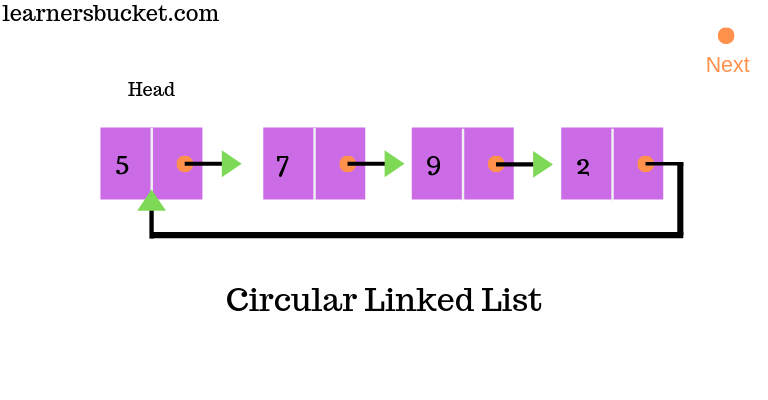

# Circular Linked List Data Structure

## Definition
A Circular Linked List is a variation of linked list in which the last node points back to the first node, creating a circle-like structure.



## Key Properties
1. **Circular Structure**: The last node points to the first node, forming a closed loop.
2. **No Null Termination**: There's no null at the end of the list.
3. **Dynamic Size**: Can grow or shrink in size during execution.
4. **Continuous Traversal**: Can be traversed starting from any point in the list.

## Types of Circular Linked Lists
1. **Singly Circular Linked List**: Each node has a single pointer to the next node.
2. **Doubly Circular Linked List**: Each node has pointers to both next and previous nodes.

## Basic Components
1. **Node**: Contains data and pointer(s) to other node(s).
2. **Head**: Points to any node in the list (often the first inserted node).

## Basic Operations
1. **Insertion**: Add a new node (at the beginning, end, or middle).
2. **Deletion**: Remove a node (from the beginning, end, or middle).
3. **Traversal**: Visit each node in the list.
4. **Search**: Find a node with a specific value.

## Time Complexity
- Access: O(n)
- Search: O(n)
- Insertion: O(1) if inserting at known position, O(n) if searching first
- Deletion: O(1) if deleting known position, O(n) if searching first

## Memory Usage
- Memory = (size of data + size of pointer) * (number of nodes)
- No additional memory for tail pointer needed

## Advantages
1. Constant-time insertion at the beginning and end of the list
2. Simplified list operations (no need to check for null)
3. Useful for applications that require repetitive cycling through a list
4. Efficient memory utilization (no null pointers)

## Real-World Use Cases of Circular Linked Lists

Circular Linked Lists find applications in various domains due to their unique properties. Here are some notable real-world use cases:

1. **Operating System Resource Management**
   - Process Scheduling: Used in round-robin scheduling algorithms where each process gets a fixed time slice in a cyclic manner.
   - Memory Management: In systems using circular memory allocation strategies.

2. **Computer Networking**
   - Token Ring Networks: In this network topology, a token is passed around the network in a circular manner.
   - Bluetooth Device Discovery: For managing the list of discoverable devices in a circular fashion.

3. **Multimedia Applications**
   - Playlist Management: For creating looping playlists in music or video players.
   - Image Carousel: In web and mobile applications for cycling through images.

4. **Gaming**
   - Turn-Based Board Games: To manage player turns in multiplayer games.
   - Circular Buffering in Game Engines: For efficient memory management in game loops.

5. **Embedded Systems**
   - Task Scheduling: In real-time operating systems for cyclic execution of tasks.
   - Circular Buffers: Used in data logging and communication protocols.

6. **Database Systems**
   - Query Optimization: For managing circular dependencies in query execution plans.
   - Buffer Pool Management: In database management systems for cyclical page replacement.

7. **Computer Graphics**
   - Vertex Management: In 3D graphics for closed polygonal models.
   - Animation Loops: For creating seamless looping animations.

8. **Timekeeping and Scheduling Applications**
   - Circular Clock Representations: For digital clock implementations.
   - Appointment Scheduling: In calendar applications for recurring events.

9. **Text Editing and Word Processing**
   - Undo-Redo Functionality: Maintaining a circular history of document changes.
   - Cursor Movement: For wrapping cursor movement in text editors.

10. **Financial Systems**
    - Rotating Savings and Credit Associations (ROSCAs): For managing cyclical distribution of funds.
    - Circular Debt Management: In financial modeling of circular debt scenarios.

11. **Transportation and Logistics**
    - Traffic Light Control Systems: For cyclic management of traffic signal phases.
    - Delivery Route Optimization: In logistics for routes that return to the starting point.

12. **Telecommunications**
    - Call Center Queue Management: For fair distribution of incoming calls to agents.
    - Cellular Network Channel Allocation: In mobile networks for frequency reuse patterns.

13. **Manufacturing and Industrial Automation**
    - Assembly Line Management: For cyclical process control in manufacturing.
    - Robotic Arm Movement: In industrial robots for repetitive task execution.

14. **Scientific Simulations**
    - Planetary Orbit Calculations: In astrophysics simulations.
    - Molecular Structure Modeling: For cyclic molecular structures in chemistry.

These use cases demonstrate the versatility of Circular Linked Lists in solving problems that involve cyclic or repetitive processes, resource sharing, and efficient memory management across various fields and industries.

## Disadvantages
1. Slightly more complex implementation than singly linked list
2. Risk of infinite loops if not implemented carefully
3. No natural end point, requiring special consideration during traversal

## Common Use Cases
1. Round-robin scheduling in operating systems
2. Implementing circular buffers
3. Managing computer resources in a multi-user environment
4. Multiplayer board games (turn rotation)
5. Repetitive task management in embedded systems

## Variations
1. **Josephus Problem**: A counting-out game, often implemented using circular linked lists
2. **Circular Buffer**: Also known as a ring buffer, used in embedded systems and data streaming

## Memory Techniques for Retention
1. **Visualization**: Imagine a merry-go-round where you can start from any horse and go around indefinitely.
2. **Analogy**: Compare to a circular race track where runners keep going around without a finish line.
3. **Acronym**: CIRCLE (Circularly Interconnected Repeating Cyclic Linked Elements)
4. **Mnemonic**: "Round and round the list we go, where it stops, there's no null to show"

## Code Example (Python)

```python
class Node:
    def __init__(self, data):
        self.data = data
        self.next = None

class CircularLinkedList:
    def __init__(self):
        self.head = None

    def is_empty(self):
        return self.head is None

    def insert_end(self, data):
        new_node = Node(data)
        if self.is_empty():
            self.head = new_node
            new_node.next = self.head
        else:
            current = self.head
            while current.next != self.head:
                current = current.next
            current.next = new_node
            new_node.next = self.head

    def insert_beginning(self, data):
        new_node = Node(data)
        if self.is_empty():
            self.head = new_node
            new_node.next = self.head
        else:
            current = self.head
            while current.next != self.head:
                current = current.next
            new_node.next = self.head
            current.next = new_node
            self.head = new_node

    def delete(self, key):
        if self.is_empty():
            return

        if self.head.data == key and self.head.next == self.head:
            self.head = None
        elif self.head.data == key:
            current = self.head
            while current.next != self.head:
                current = current.next
            current.next = self.head.next
            self.head = self.head.next
        else:
            current = self.head
            prev = None
            while current.next != self.head:
                prev = current
                current = current.next
                if current.data == key:
                    prev.next = current.next
                    break

    def display(self):
        if self.is_empty():
            return "List is empty"
        elements = []
        current = self.head
        while True:
            elements.append(str(current.data))
            current = current.next
            if current == self.head:
                break
        return ' -> '.join(elements) + ' -> (back to start)'

# Usage example
cll = CircularLinkedList()
cll.insert_end(1)
cll.insert_end(2)
cll.insert_beginning(0)
print(cll.display())  # Output: 0 -> 1 -> 2 -> (back to start)
cll.delete(1)
print(cll.display())  # Output: 0 -> 2 -> (back to start)
```
