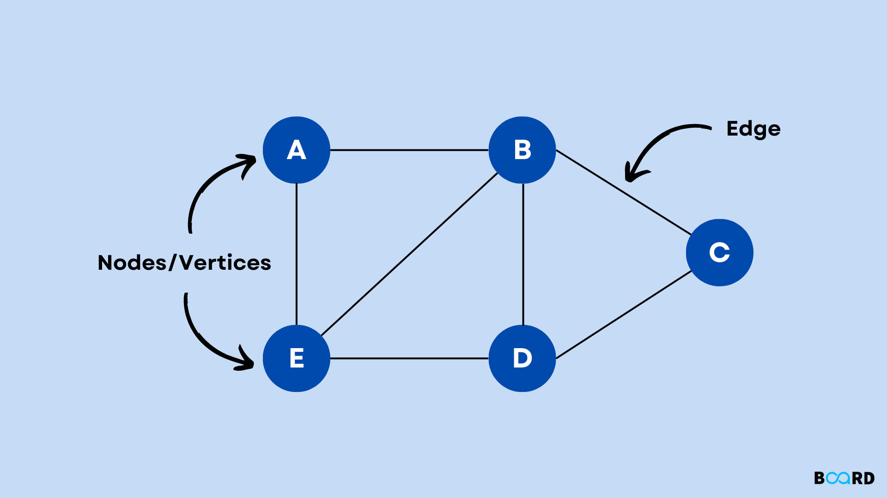
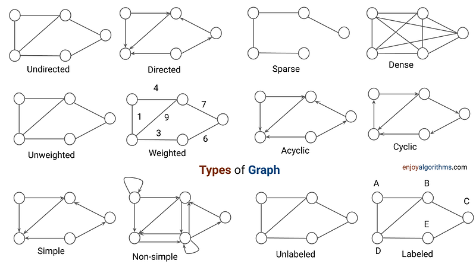

# Graph Data Structure

## Definition
A Graph is a non-linear data structure consisting of vertices (or nodes) and edges that connect these vertices. It is used to represent relationships between pairs of objects.



## Key Properties
1. **Vertices**: The fundamental units of the graph.
2. **Edges**: Connections between pairs of vertices.
3. **Direction**: Graphs can be directed (edges have direction) or undirected.
4. **Weight**: Edges can have weights to represent costs, distances, etc.
5. **Connectivity**: A graph can be connected or disconnected.
6. **Cyclicity**: A graph can be cyclic or acyclic.

## Types of Graphs
1. **Undirected Graph**: Edges have no direction.
2. **Directed Graph (Digraph)**: Edges have direction.
3. **Weighted Graph**: Edges have associated weights.
4. **Complete Graph**: Every vertex is connected to every other vertex.
5. **Bipartite Graph**: Vertices can be divided into two disjoint sets.
6. **Tree**: A connected acyclic graph.



## Basic Components
1. **Vertex**: A node in the graph.
2. **Edge**: A connection between two vertices.
3. **Path**: A sequence of vertices connected by edges.
4. **Cycle**: A path that starts and ends at the same vertex.

## Basic Operations
1. **Add Vertex**: Insert a new vertex into the graph.
2. **Add Edge**: Add a new edge between two vertices.
3. **Remove Vertex**: Delete a vertex and all its incident edges.
4. **Remove Edge**: Delete an edge between two vertices.
5. **Graph Traversal**: Visit all vertices in a graph (BFS, DFS).
6. **Search**: Find a path between two vertices.

## Representations
1. **Adjacency Matrix**: 2D array where rows and columns represent vertices.
2. **Adjacency List**: Array of lists, each representing connections of a vertex.
3. **Edge List**: List of all edges in the graph.

## Time Complexity (for V vertices and E edges)
- Adjacency Matrix:
  - Add Vertex: O(V^2)
  - Add Edge: O(1)
  - Remove Vertex: O(V^2)
  - Remove Edge: O(1)
  - Query: O(1)
  - Storage: O(V^2)
- Adjacency List:
  - Add Vertex: O(1)
  - Add Edge: O(1)
  - Remove Vertex: O(V + E)
  - Remove Edge: O(E)
  - Query: O(V)
  - Storage: O(V + E)

## Advantages
1. Model real-world relationships and networks
2. Solve complex problems like shortest path, network flow
3. Flexible structure for representing various types of data
4. Efficient for certain operations depending on representation

## Disadvantages
1. Can be complex to implement and manage
2. Some operations can be inefficient for large graphs
3. Memory intensive, especially for dense graphs

## Common Use Cases
1. Social Networks (Facebook friends, LinkedIn connections)
2. Geographic Maps and Navigation Systems
3. Computer Networks and Communication Systems
4. Recommendation Systems
5. Dependency Resolution in Software Engineering
6. Circuit Design in Electronics

## Real-World Applications of Graph and Tree Data Structures

1. Social Networks
   1. Friend recommendations
   2. Influence analysis
   3. Community detection
   4. Shortest path between two users

2. Transportation and Navigation
   1. GPS and route planning
   2. Traffic flow optimization
   3. Airline flight paths
   4. Public transit systems

3. Computer Networks
   1. Internet routing protocols
   2. Network topology analysis
   3. Data packet routing
   4. Network flow optimization

4. Biology and Genetics
   1. Phylogenetic trees (evolutionary relationships)
   2. Protein interaction networks
   3. Gene regulatory networks
   4. Ecological food webs

5. Computer Science and Software Engineering
   1. File system hierarchies
   2. Syntax trees in compilers
   3. Dependency resolution in package managers
   4. State machines and game trees

6. Artificial Intelligence and Machine Learning
   1. Decision trees in machine learning
   2. Knowledge representation
   3. Neural networks
   4. Game-playing algorithms (e.g., chess, Go)

7. Business and Organization
   1. Company hierarchies
   2. Supply chain management
   3. Project management (PERT charts)
   4. Customer relationship mapping

8. Web Technologies
   1. Web crawling and indexing
   2. DOM (Document Object Model) in web browsers
   3. Website sitemaps
   4. Hyperlink structure analysis

9. Telecommunications
   1. Call routing in telephone networks
   2. Network capacity planning
   3. Cellular tower placement

These applications demonstrate the versatility and power of graph and tree data structures in modeling and solving complex real-world problems across various domains. The ability to represent relationships, hierarchies, and networks makes these structures fundamental tools in computer science and beyond.

## Algorithms
1. **Breadth-First Search (BFS)**: Level-wise traversal
2. **Depth-First Search (DFS)**: Explore as far as possible along branches
3. **Dijkstra's Algorithm**: Find shortest paths in weighted graphs
4. **Bellman-Ford Algorithm**: Find shortest paths with negative weights
5. **Floyd-Warshall Algorithm**: All pairs shortest paths
6. **Kruskal's and Prim's Algorithms**: Minimum Spanning Tree
7. **Topological Sorting**: Ordering of vertices in a directed acyclic graph

## Memory Techniques for Retention
1. **Visualization**: Imagine a social network diagram with people as nodes and friendships as edges.
2. **Analogy**: Compare to a road map where cities are vertices and roads are edges.
3. **Acronym**: VENOM (Vertices and Edges in a Network Object Model)
4. **Mnemonic**: "Vertices vex, edges express, in graphs we connect and progress"

## Code Example (Python)
```python
from collections import defaultdict

class Graph:
    def __init__(self):
        self.graph = defaultdict(list)

    def add_edge(self, u, v):
        self.graph[u].append(v)

    def bfs(self, start):
        visited = set()
        queue = [start]
        visited.add(start)

        while queue:
            vertex = queue.pop(0)
            print(vertex, end=" ")

            for neighbor in self.graph[vertex]:
                if neighbor not in visited:
                    visited.add(neighbor)
                    queue.append(neighbor)

    def dfs_util(self, v, visited):
        visited.add(v)
        print(v, end=" ")

        for neighbor in self.graph[v]:
            if neighbor not in visited:
                self.dfs_util(neighbor, visited)

    def dfs(self, start):
        visited = set()
        self.dfs_util(start, visited)

# Usage example
g = Graph()
g.add_edge(0, 1)
g.add_edge(0, 2)
g.add_edge(1, 2)
g.add_edge(2, 0)
g.add_edge(2, 3)
g.add_edge(3, 3)

print("BFS starting from vertex 2:")
g.bfs(2)
print("\nDFS starting from vertex 2:")
g.dfs(2)
```
